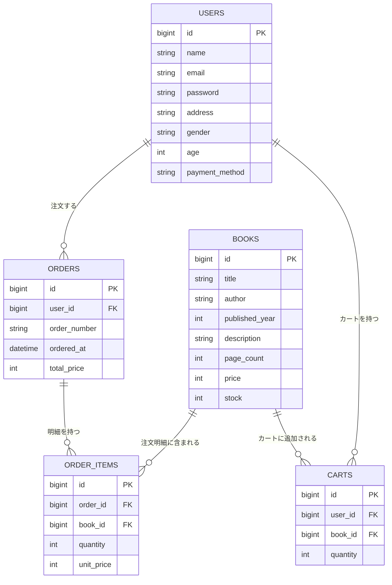

# 書籍購入API

Spring Boot + MySQL + Docker で構築した書籍購入APIです。   
DBカラム設計から考えてみたいと思い作成しました。

## 技術スタック

| 技術 | バージョン |
|---|---|
| Java | 21 |
| Spring Boot | 3.5.13 |
| MySQL | 8.0 |
| Docker | - |

## 機能一覧

- ユーザー登録・取得・更新・削除
- 書籍登録・一覧・検索・更新・削除
- カート追加・取得・削除
- 注文（カートの中身をもとに注文作成・カート自動削除）
- 注文履歴取得

## ER図



## API一覧

| メソッド | URL | 内容 |
|---|---|---|
| POST | `/api/users` | ユーザー登録 |
| GET | `/api/users/{id}` | ユーザー取得 |
| PUT | `/api/users/{id}` | ユーザー更新 |
| DELETE | `/api/users/{id}` | ユーザー削除 |
| GET | `/api/books` | 書籍一覧 |
| GET | `/api/books/{id}` | 書籍1件取得 |
| GET | `/api/books/search?title=xxx` | タイトル検索 |
| GET | `/api/books/price?max=xxx` | 価格以下検索 |
| POST | `/api/books` | 書籍登録 |
| PUT | `/api/books/{id}` | 書籍更新 |
| DELETE | `/api/books/{id}` | 書籍削除 |
| GET | `/api/cart/{userId}` | カート取得 |
| POST | `/api/cart` | カートに追加 |
| DELETE | `/api/cart/{userId}/{bookId}` | カートから削除 |
| POST | `/api/orders` | 注文 |
| GET | `/api/orders/{userId}` | 注文履歴取得 |
| GET | `/api/orders/detail/{id}` | 注文詳細取得 |

## DB設計

### usersテーブル
| カラム名 | 型 | 説明 |
|---|---|---|
| id | bigint | 主キー |
| name | varchar | 氏名 |
| email | varchar | メールアドレス |
| password | varchar | パスワード |
| address | varchar | 住所 |
| gender | varchar | 性別 |
| age | int | 年齢 |
| payment_method | varchar | 支払い方法 |

### booksテーブル
| カラム名 | 型 | 説明 |
|---|---|---|
| id | bigint | 主キー |
| title | varchar | タイトル |
| author | varchar | 著者 |
| published_year | int | 出版年 |
| description | varchar | 概要 |
| page_count | int | ページ数 |
| price | int | 価格 |
| stock | int | 在庫数 |

### ordersテーブル
| カラム名 | 型 | 説明 |
|---|---|---|
| id | bigint | 主キー |
| user_id | bigint | 外部キー（users） |
| order_number | varchar | 注文番号 |
| ordered_at | datetime | 注文日時 |
| total_price | int | 合計金額 |

### order_itemsテーブル
| カラム名 | 型 | 説明 |
|---|---|---|
| id | bigint | 主キー |
| order_id | bigint | 外部キー（orders） |
| book_id | bigint | 外部キー（books） |
| quantity | int | 数量 |
| unit_price | int | 単価 |

### cartsテーブル
| カラム名 | 型 | 説明 |
|---|---|---|
| id | bigint | 主キー |
| user_id | bigint | 外部キー（users） |
| book_id | bigint | 外部キー（books） |
| quantity | int | 数量 |

## 起動方法

```bash
docker compose up --build
```


## 動作確認

### ユーザー登録


### 書籍登録


### カートに追加


### 注文


### 備忘録
postmanで動作確認をした際、orderとorderitemがループしてしまったため@JsonManagedReference と @JsonBackReferenceを追加

### 今後
フロントも作成予定
